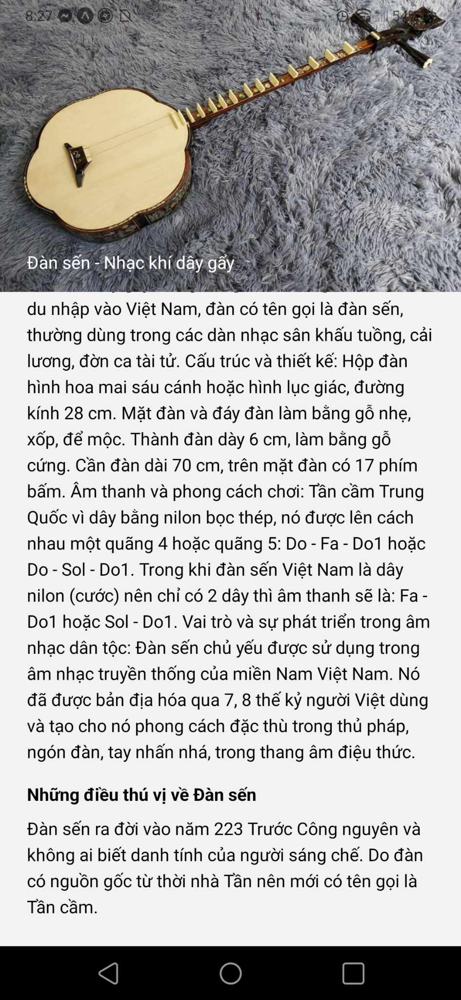

<!-- # CodeCrafters

 -->

## Demo App

## Table of Contents
- [Table of Contents](#table-of-contents)
  - [About](#about)
  - [Features](#features)
  - [Screenshots](#screenshots)
  - [Getting Started](#getting-started)
    - [Prerequisites](#prerequisites)
    - [Installation](#installation)

## About

Explore and experience traditional music of the three regions of North, Central and South Vietnam with the Vietnamese Folk Instruments application. This is a priceless musical treasure, synthesizing hundreds of types of folk instruments and unique traditional music from across the country.

## Features
- Search
- Audio
- Interesting Things

## Screenshots

<p float='left'>



</p>


## Getting Started

### Prerequisites

- Node.Js: https://nodejs.org/en
- Expo: https://docs.expo.dev/get-started/installation/
- Yarn: https://classic.yarnpkg.com/lang/en/docs/install/#mac-stable

### Installation

- Clone the repository to your local machine
- Install dependencies using npm or yarn
- Run the app using `yarn start` or another suitable command

```bash
git clone https://github.com/akiyamahaa/expo-tech-app.git
cd expo-tech-app
yarn
yarn start